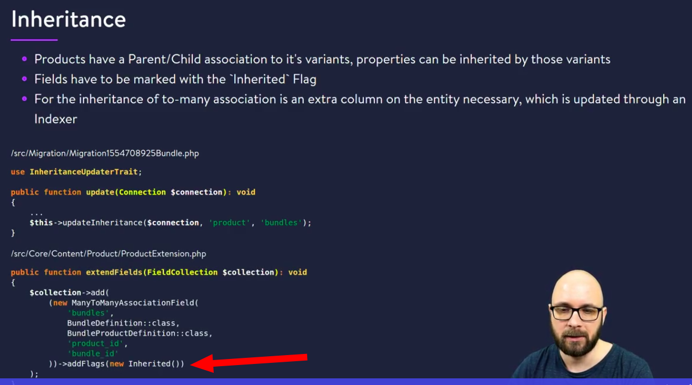

# Shopware 6 - Template Training Advanced (EN)

## 2 Creating a theme
create the theme `./bin/console theme:create`
set name `SwagTemplateAdvanced`
then refresh plugin (because theme is plugin also) .`/bin/console plugin:refresh`
activate plugin `./bin/console plugin:install --activate SwagTemplateAdvanced`
change the theme `./bin/console theme:change`
disable cache
build storefront `./bin/build-storefront.sh`
build administration `./bin/build-administration.sh`
watch changes `./bin/watch-storefront.sh` it doesn't work for us. We use  `./bin/build-storefront.sh`


## 3 General installation
installation:
- MacOS using MAMP
- Vargrant Vm (windows, linux, mac)

repos:
`shopware/platform` - main mono repository
`shopware/development` - symfony template (now is deprecated)
`shopware/production`

psh - (php shell helper )task runner for php. For not-symfony stuff
we can install SW by psh - ./psh.phar `docker:start`
cypress is used for testing

Disable twig cache - ad new param `cache:false`
`core/Framework/Resources/config/packages/twig.yaml` 

All js plugins must be imported in main.js file
css can be imported in base.scss (for example @import "sticky-header")
to dev scss run `psh.phar storefront:hot-proxy`. site will be runs on 9998 port

to get all plugins, which are bound with element, use `window.PluginManager.getPluginInstancesFromElement(element)`
reinitialize plugin `this.PluginManager.initializePlugin('FlyoutMenu', '[data-flyout-menu]', {})`

options priority (from lowest to biggest)
1.  In plugin js file
```javascript
export default class StickyHeader extends Plugin{
    static options = {
        showOnScrollPosition: 100
    }
 }
```
2. in plugin registration
```js
window.PluginManager.register('StickyHeader', StickyHeader, '[data-sticky-header]', {
    showOnScrollPosition: 250
})
```
3. inside twig template
```twig
 <div class="js-navigation-wrapper" data-sticky-header="true" data-sticky-header-options='{"showOnScrollPosition": "500"}'></div>
```

## JavaScript plugin quantity field
Plugin options - if you want to add options - you can do it with data attributes. 
For example - if plugin is registered as `Quantity`, options must be set as `data-quantity-options` attribute

Icons can be found here https://shopware.github.io/meteor-icon-kit/
to display svg icons use ` `


For url use function from twig - `path` - example - `path('frontend.account.payment.page')`


Create custom fields - Settings -> System ->  Custom fields -> Add new Set


We have to use translated property always. example - `{{product.translated.name}}`

we can override sw scss variables - have to create config with specific name for example `sw-color-brand-primary`


---  
___  

# Developer
## Some structure
`custom/plugins` - plugins are there  
`core/Framework/DataAbstractionLayer` - replace symfony ORM doctrine. It is faster  

## Plugin
Create plugin `./bin/console plugin:create SwagShopFinder`  
files will be created in `custom/plugins/SwagShopFinder`  

file `custom/plugins/SwagShopFinder/composer.json`

```json
{
  "name": "swag/plugin-skeleton", // can be changed
  "description": "Skeleton plugin",
  "type": "shopware-platform-plugin", // Can't be changed. Other name will be ignored
  "license": "MIT",
  "autoload": {
    "psr-4": {
      "SwagShopFinder\\": "src/" // It is namespace and source folder. Can be changed. But is better do not chan ge it.
    }
  },
  "extra": { // is metainformation for shopware
    "shopware-plugin-class": "SwagShopFinder\\SwagShopFinder", // tells to shopware where to find class
    "label": {
      "de-DE": "Skeleton plugin",
      "en-GB": "Skeleton plugin"
    }
  }
}
```
`src/SwagShopFinder.php`  
class `SwagShopFinder\SwagShopFinder` extends from `Shopware\Core\Framework\Plugin`. It contains livecycle events of plugin  
`src/Resources/config/services.xml` - add services here  
Shopware plugins are the symfony bundles.  
___

To enable plugin:
1. `plugin:refresh` - tells sw open plugins folder and reread
2. `plugin:install` 
3. `plugin:activate`
___

## Entity
Each entity consists of `EntityDefinition`, `Entity`, `Collection`.  
`ShopFinderDefinition.php` - fields  
`ShopFinderEntity.php` - includes getters and setters. Uses in code to get/set fields values  
`ShopFinderCollection.php`  
Then we have to add service with id of definition
```xml
<service id="SwagShopFinder\Core\Content\ShopFinder\ShopFinderDefinition">
    <tag name="shopware.entity.definition" entity="swag_shop_finder" />
</service>
```
create migration: `./bin/console database:create-migration -p SwagShopFinder`
File will be created `custom/plugins/SwagShopFinder/src/Migration/Migration1672319626.php`
`update` - ran if plugin is installed or updated  
`updateDestructive` - make changes for existing plugins that are destructive 
___

## Routing
`src/Core/Api/DemoDataController.php`
```php
/**
 * @RouteScope(scopes={"api"})
 */
class DemoDataController extends AbstractController
{
     /**
     * @Route("api/v{version}/_action/swag-shop-finder/generate", name="api.custom_swag_shop_finder.generate", methods={"POST"})
     */
    public function generate(Context $context): Response
    {
        //...
        return new Response('', Response::HTTP_NO_CONTENT);
    }
}

```
`src/Resources/config/routes.xml`
```php
<import resource="../../**/Api/*Controller.php" type="annotation" />
```
See https://developer.shopware.com/docs/guides/plugins/plugins/framework/store-api/add-store-api-route#register-route

## Plugin configuration
`src/Resources/config/config.xml`  
```xml
<card>
    <title>Basic configuration </title>
    <title lang="de-DE">Basic configuration DE </title>
    <input-field type="bool">
        <name>showInStorefront</name>
        <label>Show in storefront</label>
        <label lang="de-DE">Show in storefront DE</label>
    </input-field>
</card>
```
see https://developer.shopware.com/docs/guides/plugins/plugins/plugin-fundamentals/add-plugin-configuration#fill-your-plugin-configuration-with-settings

## Subscriber
`services.xml`
```xml
<service id="SwagShopFinder\Storefront\Subscriber\FooterSubscriber">
    <tag name="kernel.event_subscriber"/>
</service>
```
Event class
```php
class FooterSubscriber implements EventSubscriberInterface {

    public static function getSubscribedEvents() // is required
    {
        return [
            FooterPageletLoadedEvent::class => 'onPageletLoaded' // onPageletLoaded is our method
        ];
    }
}

```

To get config value `$this->systemConfigService->get('SwagShopFinder.config.showInStorefront')`

___
## Create api key
Settings -> Integrations
then use to generate `access_token`
```
{
    "client_id":"SWIAMLFXQWJGSKJ5ANGZUM1JNQ",
    "client_secret": "dWZxUkdvTXBGTUh4MXJIcVpuQmFUaUR3OHR5MzkzY3VCTm05RUg",
    "grant_type" : "client_credentials"
}
```

## To add translation:
1. create class `/Resources/snippet/en_GB/SnippetFile_en_GB.php` implements `SnippetFileInterface` and add methods.
2. add service
    ```xml
    <service id="SwagShopFinder\Resources\snippet\en_GB\SnippetFile_en_GB">
        <tag name="shopware.snippet.file"/>
    </service>
    ```
3. create file `Resources/snippet/en_GB/storefront.en-GB.json` in the same folder as `SnippetFile_en_GB.php` and add translations
4. display string in template `{{ 'swag_shop_finder.phone'|trans }}`

---  
___  

## Developer Training Advanced
### Entity consists 3 classes:
**Entity**: object-oriented mapping of data structure  
**Entity Definition**: Maps the entity to database structure  
**Entity Collection**: - Collection of entities  


### Example: Entity Definition
`/src/Core/Content/Bundle/BundleDefinition.php`
```php
class BundleDefinition extends EntityDefinition{
    public function getEntityName(){
        return 'swag_bundle';
    }
    public function getEntityClass(){
        return BundleEntity::class
    }
    public function getCollectionClass(){
        return BundleCollection::class;
    }
    protected function defineFields(){
        return new FieldCollection([
              //........
        ])
    }
}

```

### Example: Entity
`/src/Core/Content/Bundle/BundleEntity.php`
```php
class BundleEntity extends Entity{

    use EntityTrait;
    
    protected $name;
    
    public function getName(){
        return $this->name;
    }
        public function setName($name){
        $this->name = $name;
    }
}


```

### Example: Entity collection
`/src/Core/Content/Bundle/BunleCollection.php`
```php
class BundleCollection extends EntityCollection{
    protected function getEntityCollectionClass(){
        return BundleEntity::class;
    }
}

```
---
**Definition** must be added to `services.xml` in this way
```xml
<service id="SwagShopFinder\Core\Content\ShopFinder\ShopFinderDefinition">
    <tag name="shopware.entity.definition" entity="swag_shop_finder" />
</service>
```
___ 
### Entity Translation
Definition example
`/src/Core/Content/Bundle/Aggregate/BundleTranslation/BundleTranslationDefinition.php`
```php
class BundleTranslationDefinition extends EntityTranslationDefinition{

    public function getParentDefinitionClass(){
        return BundleDefinition::class // It is definition class
    }
    
    protected defineFields(){
    // contains only fields that i want to translate
        return FieldCollection([
            (new StringField("name", "name"))->addFlags(new Required())
        ])
    }
}
```

`/src/Core/Content/Bundle/BundleDefinition.php`
```php
protected function defineFields(){
    return new FieldCollection([
        (new IdFIeld("id", "id"))->addFlags(new Requred(), new PrimaryKey()),
        new TranslatedField("name"), // this field we will use in BundleTranslationDefinition::defineFields
        new TranslationsAssociationField(BundleTranslationDefinition::class, 'swag_bundle_id')

    ])
}

```
---

### Associations
```php
TranslationAssociationField(BundleTranslationDefinition, 'swag_bundle_id')
OneToOneAssociationField('avatarMedia', 'avatarId', 'id', MediaDefinition::class, true)
OneToManyAssociationField('accessKeys', UserAccessKeyDefinition::class, 'user_id', 'id')
ManyToOneAsociationField('locale', 'locale_id', LocaleDefinition::class, 'id', false)
ManyToManyAssocociiationField('aclRoles', AclRoleDefinition::class, AclUserRoleDefinition::class, 'user_id', 'acl_role_id')

```
### Associations example
`src/core/Content/Bundle/BundleDefinition.php`
```php

class BundleDefinition extends EntityDefinition{

    protected function defineFields(){
      return new FieldCollection([
          new ManyToManyAssociationField('products', ProductDefinition::class, BundleProductDefinition::class, 'bundle_id', 'product_id')
        ])
    }

}
```
`/src/Core/Content/Bundle/Aggregation/BundleProduct/BundleProductDeinition.php`
```php
class BundleProductDefinition extends MappingEntityDefinition{
   return new FieldCollection([
            (new FkField('bundle_id', 'bundleId', BundleDefinition::class))->addFlags(new PrimaryKey(), new Required()),
            (new FkField('product_id', 'productId', ProductDefinition::class))->addFlags(new PrimaryKey(), new Required()),
            (new ReferenceVersionField(ProductDefinition::class))->addFlags(new PrimaryKey(), new Requried()),
            new ManyToOneAssociationField('bundle', 'bundle_id', BundleDefinition::class),
            new ManyToOneAssociationField('product', 'product_id', ProductDefinition::class),
            new CreatedAtField(),
        ]);  
}

```
---
### Entity extension
`/src/Core/Content/Product/ProductExtension.php`
```php
public function getDefinitionClass(){
    return ProductDefinition::class;
}
public function extendFields($collection){
    $collection->add(
            (new ManyToManyAssociationField(
            'bundles',
            BundleDefinition::class,
            BundleProductDefinition::class,
            'product_id',
            'bundle_id'
            ))->addFlags(new Inherited())
    )

}
```

then register extension
`/src/Resources/config/services.xml`
```xml
<service id="Swag\Bundle\Core\Content\Product\ProductExtension">
    <tag name="shopware.entity.extension"/>
</service>
```
---
### Inheritance
  

___

### Migration
After you created definitions, entity and collection, you have to create migration.
create migration with
`./bin/console database:create-migration --name Bundle -p BundleExample` - it will create migration file `custom/plugins/BundleExample/src/Migration/Migration1680773769Bundle.php`
then you have to create schema
`./bin/console dal:create:schema`  -it will create file `schema/swag.sql`. It will contain sql queries. You can put them in migration file (Migration1680773769Bundle.php)
___
### Administration module

`src/Resources/app/administration` - put here everything, what is related with administration  
___
`src/Resources/app/administration/src/module/swag-bundle/index.js` - here we register our module with factory and fill fields. See
```js
const { Module } = Shopware; // get shopware factory module
Module.register('swag-bundle', {
    type: 'plugin',
    name: 'bundle', // because we named swag bundle
    title: 'swag-bundle.general.mainMenuItemGeneral', // get from snipet
    description: 'sw-property.general.descriptionTextModule', // get from snipet
    color: '#FFD700', // color for icon
    icon: 'default-shopping-paper-bag-product', // check vendor/shopware/administration/Resources/app/administration/src/app/assets/icons/svg

    snippets: {
        'de-DE': deDE,
        'en-GB': enGB
    },

    routes: {
        list: {
            component: 'swag-bundle-list',
            path: 'list'
        },
        detail: {
            component: 'swag-bundle-detail',
            path: 'detail/:id',
            meta: {
                parentPath: 'swag.bundle.list'
            }
        },
        create: {
            component: 'swag-bundle-create',
            path: 'create',
            meta: {
                parentPath: 'swag.bundle.list'
            }
        }
    },

    navigation: [{
        label: 'swag-bundle.general.mainMenuItemGeneral',
        color: '#FFD700', // color for icon
        path: 'swag.bundle.list',
        icon: 'default-shopping-paper-bag-product',
        position: 100
    }]
});

```
___
`src/Resources/app/administration/src/main.js` - Entry point. Import here everything
```js
`import './module/swag-bundle'`
```

`src/Resources/app/administration/src/module/swag-bundle/snippet/de-DE.json` and `en-GB.json` - translations

after js-admin changes run `./bin/build-administration.sh` - it builds js files  
`./bin//watch-administration.sh` - watch admin js on port 8080
___
bottlejs is DI for JS
___  
vuejs template -  
**slots** - use existed component and reconfigure for my needs  
**block** - override

`Component.override` - override existed component  
`Component.register` - create new component  
`Component.extend` - extend from existed component and create new one  
___
Administration pages are located in `src/Resources/app/administration/src/module/swag-bundle/page/` folder
one page could have 2 files:

1. template `src/Resources/app/administration/src/module/swag-bundle/page/swag-bundle-list/swag-bundle-list.html.twig`
    ```html
    
        <sw-page class="swag-bundle-list"> <!--we use sw-page component and set our class-->
            <template slot="smart-bar-actions">
                <!-- Can put here some template-->
            </template>
            <template slot="content">
                    <!-- Can put here some template-->
            </template>
        </sw-page>
    
    ```
2. logic `src/Resources/app/administration/src/module/swag-bundle/page/swag-bundle-list/index.js`
    ```js
    import template from './swag-bundle-list.html.twig'; // our template
    
    const { Component } = Shopware;
    const { Criteria } = Shopware.Data;
    
    Component.register('swag-bundle-list', {
        template,
    
        inject: [
            'repositoryFactory'  // get from bottlejs. We need to use shopware api here. It isDI
        ],
        //.....
        computed: {
            columns() { // columns for the table
                return [{
                    property: 'name',
                    dataIndex: 'name',
                    label: this.$t('swag-bundle.list.columnName'),
                    routerLink: 'swag.bundle.detail',
                    inlineEdit: 'string',
                    allowResize: true,
                    primary: true
                }];
            }
        },
    
        created() {
            this.repository = this.repositoryFactory.create('swag_bundle'); // create repository
    
            // now we can fetch data
            this.repository.search(new Criteria(), Shopware.Context.api).then((result) => {
                this.bundles = result;
            });
        }
    });
    ```
then go to `src/Resources/app/administration/src/module/swag-bundle/index.js`
```js
import './page/swag-bundle-list'; // add our list component
//.....
// add our component to route
    {
        routes: {
            index: {
                component:'swag-bundle-list',
                path: 'index'
            }
        }
    }
```
___
### Mixins
To catch the error in our case, we have to add mixin in our Component

```js
const { Mixin } = Shopware;
    //...
    mixins: [
        Mixin.getByName('notification') // this will add createNotificationError method
    ]
    //....
```
Then we can call in catch method where we need
```js
 this.createNotificationError({
    title: this.$t('swag-bundle.detail.errorTitle'),
    message: exception
});
```
https://shopware.design/ - here are all admin components
___
### Extend component
We can create component by extending existed
```js
Component.extend('swag-bundle-create', 'swag-bundle-detail', {
    methods: {
        //... methods, that need to modify
    }
});
```
___
### Override component
override behaviour of existed component. Example
`src/Resources/app/administration/src/extension/sw-product/page/sw-product-detail/index.js`
```js
const { Component } = Shopware;
Component.override('sw-product-detail', {
    computed: {
        productCriteria() {
            const criteria = this.$super('productCriteria');
            criteria.addAssociation('bundles');
            return criteria;
        },
    }
});

```
Then import overrided component in `main.js`
___
### Extend frontend for our bundle
1. Create subscriber
    `src/Storefront/Page/Product/Subscriber/ProductPageCriteriaSubscriber.php`
    ```php
    class ProductPageCriteriaSubscriber implements EventSubscriberInterface{
        public static function getSubscribedEvents(){
            return [ProductPageCriteriaEvent::class => 'onProductCriteriaLoaded'];
        }
        public function onProductCriteriaLoaded(ProductPageCriteriaEvent $event){
            $event->getCriteria()->addAssociation('bundles');
        }
    }
    ```
2. Add subscriber to services
    `src/Resources/config/services.xml`
    ```xml
    <service id="BundleExample\Storefront\Page\Product\Subscriber\ProductPageCriteriaSubscriber">
        <tag name="kernel.event_subscriber"/>
    </service>
    ```
3. Add translations for languages
    `src/Resources/snippet/en_GB/SnippetFile_en_GB.php`
    ```php
    class SnippetFile_en_GB implements SnippetFileInterface{
        public function getName(): string
        {
              return 'storefront.en-GB';
        }
        public function getPath(): string
        {
            return __DIR__ . '/storefront.en-GB.json';
        }
         //....
        public function isBase(): bool
        {
            return false;
        }
    }
    ```
    `src/Resources/snippet/en_GB/storefront.en-GB.json`
    ```json
    {
        "swag-bundle": {
            "detail": {
                "bundleBadge": "Bundle",
                "tabText": "Bundle",
                "buyButtonText": "Buy bundle and save %bundleDiscount%"
            }
        }
    }
    ```
4. rewrite template
    ```
    

    {# @var page \Shopware\Storefront\Page\Product\ProductPage #}
    
        
            <div class="badge badge-primary">
                {{ 'swag-bundle.detail.bundleBadge'|trans }}
            </div>
        
        {{ parent() }}
    
   ```
refresh index - `./bin/console dal:refresh:index`
___

### Shopping cart collector
Collect method of card processor - if you want to change something in cart. There are 2 methods:
- collect() - add something to the card
- process() - calculate items
These methods could be called multiple times
`src/Resources/config/services.xml`
```xml
<service id="BundleExample\Core\Checkout\Bundle\Cart\BundleCartProcessor">
    <!-- inject before product processor (5000) -->
    <tag name="shopware.cart.processor" priority="6000" />
    <tag name="shopware.cart.collector" priority="6000" />
</service>
```
`src/Core/Checkout/Bundle/Cart/BundleCartProcessor.php`
```php
class BundleCartProcessor implements CartProcessorInterface, CartDataCollectorInterface
{
    public function collect(CartDataCollection $data, Cart $original, SalesChannelContext $context, CartBehavior $behavior): void
    {
        // call fetch bundles
        // add fetched data to the card collection
        // iterate all bundle items and enrichBundle, addMissingProducts, addDiscount
    }
        public function process(CartDataCollection $data, Cart $original, Cart $toCalculate, SalesChannelContext $context, CartBehavior $behavior): void
    {
        // get all bundle items from cart
        // iterate and call calculateChileProductPrices
        // call calculateDiscount
        // set price of bundle line item
        // add bundle item $toCalculate cart
    }
}
```
Line item - it is what we display to user. It is only text
By default LineItems are not removable. We have to setRemovable(true)
___

### Custom rule
```xml
<service id="BundleExample\Core\Checkout\Bundle\Cart\Rule\CartContainsBundleRule">
    <tag name="shopware.rule.definition"/>
</service>
```
`src/Core/Checkout/Bundle/Cart/Rule/CartContainsBundleRule.php`
```php

class CartContainsBundleRule extends Rule
{
    public function getName(): string
    {
        return 'swagBundleContainsBundle';
    }

    public function match(RuleScope $scope): bool
    {
        // check if rule is matching true|false
    }

    public function getConstraints(): array
    {
        return [];
    }
}

```

`src/Resources/app/administration/src/decorator/rule-condition-service-decoration.js`
```js
import '../core/component/swag-cart-contains-bundle';
const { Application } = Shopware;

Application.addServiceProviderDecorator('ruleConditionDataProviderService', (ruleConditionService) => {
    ruleConditionService.addCondition('swagBundleContainsBundle', {
        component: 'swag-cart-contains-bundle',
        label: 'sw-condition.condition.cartContainsBundle.label',
        scopes: ['cart']
    });

    return ruleConditionService;
});

```
Add component to `src/Resources/app/administration/src/core/component/swag-cart-contains-bundle`
import `rule-condition-service-decoration`  to `main.js`
